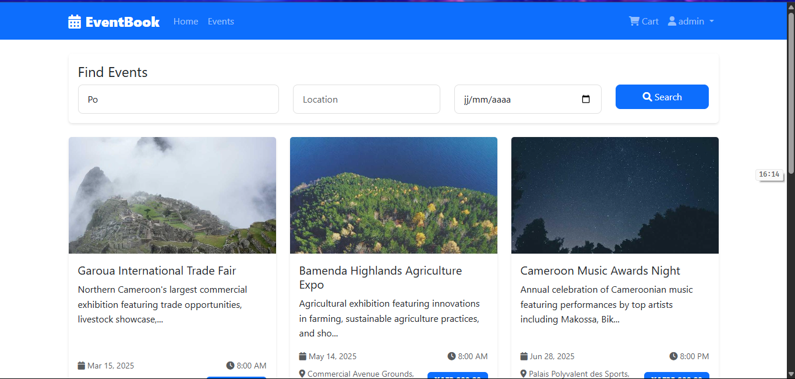
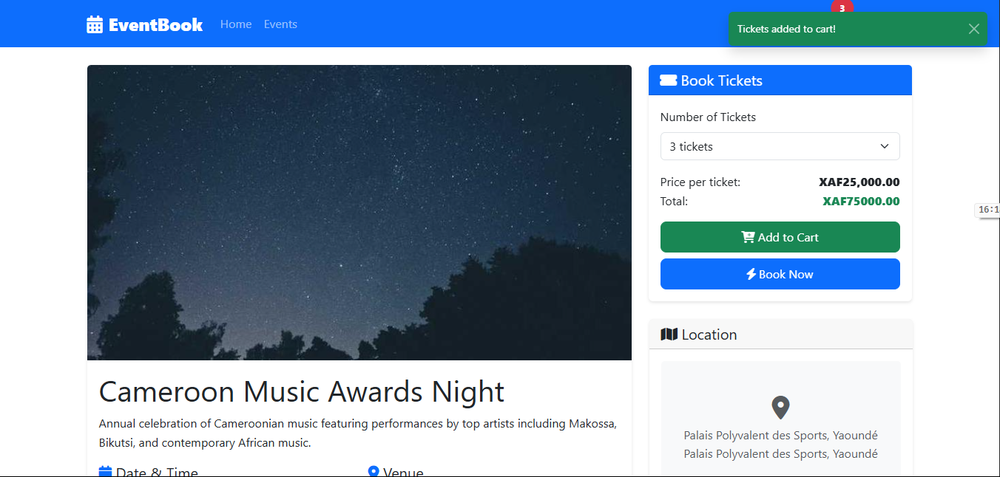
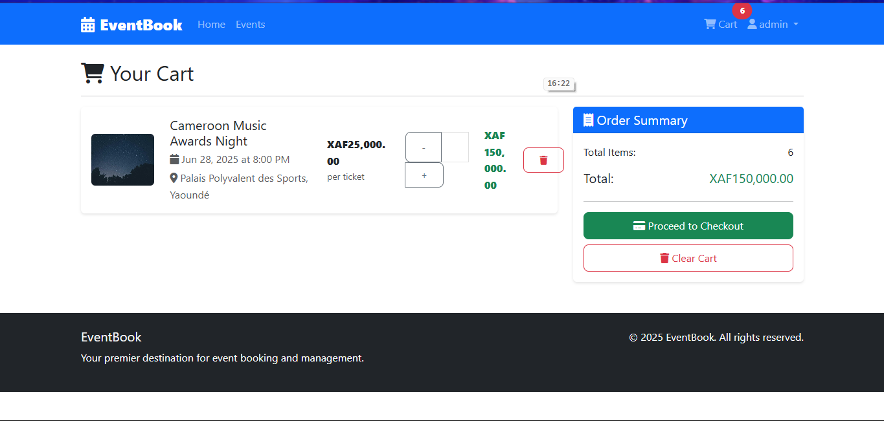
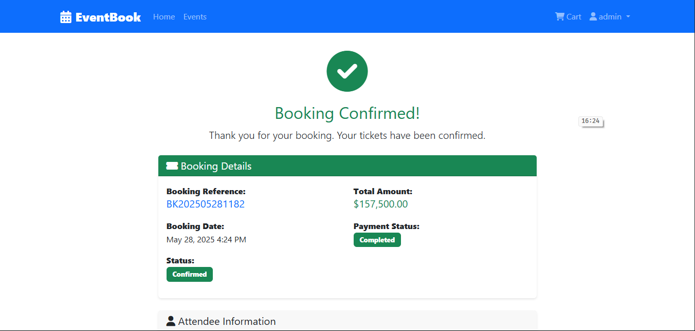
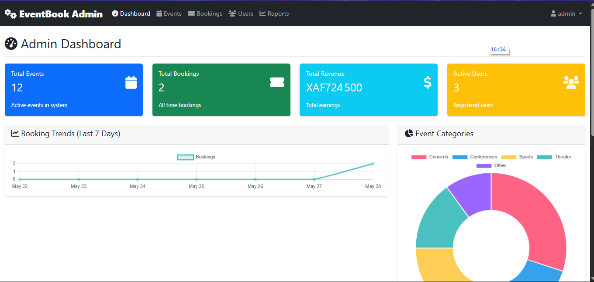

# EventBook – Event Booking Platform

EventBook is a comprehensive web-based event booking system tailored for the Cameroonian market. It enables users to discover, book, and manage event tickets, while providing administrators with powerful tools for event management, analytics, and reporting.

---

## 🚀 Features

- **Event Discovery & Search:** Browse, search, and filter cultural, business, and entertainment events.
- **Seamless Booking:** Add multiple events to your cart and complete bookings in a few clicks.
- **User Authentication:** Secure registration and login system.
- **Digital Tickets:** Downloadable tickets and booking confirmations.
- **Admin Dashboard:** Manage events, bookings, users, and generate reports.
- **Responsive Design:** Mobile-friendly interface using Bootstrap.
- **RESTful API:** Modern PHP backend with clean endpoints.

---

## 🏗️ Project Structure

```
advanced-web-dev-exam/
├── admin/         # Admin interface & APIs
├── api/           # Public API endpoints
├── assets/        # CSS, JS, images
├── auth/          # Login, register, logout
├── config/        # Database config
├── database/      # SQL schema
├── includes/      # Header, navbar, footer
├── index.php      # Homepage
├── ...            # Other core pages
```

---

## ⚙️ Setup & Installation

1. **Requirements:**

   - PHP 8.0+
   - MySQL 8.0+
   - Apache (XAMPP recommended for local dev)
   - Modern web browser

2. **Clone the repository:**

   ```
   git clone https://github.com/Nde-Dilan/advanced-web-dev-exam.git
   ```

3. **Database Setup:**

   - Import `database/schema.sql` into your MySQL server.
   - Update `config/database.php` with your DB credentials.

4. **Run Locally:**
   - Place the project folder in your XAMPP `htdocs` directory.
   - Start Apache and MySQL from XAMPP control panel.
   - Visit `http://localhost/advanced-web-dev-exam` in your browser.

---

## 📝 How It Works

- **Users:**

  - Register and log in to book events.
  - Add events to cart, checkout, and download tickets.
  - View booking history and manage bookings.

- **Admins:**

  - Access the admin panel to add/edit events, manage bookings, and generate reports.
  - View analytics and booking trends.

- **Booking Flow:**
  1. Browse/search events
  2. Add to cart
  3. Checkout (choose payment method)
  4. Receive booking confirmation & download tickets

---

## 🔒 Security

- Passwords are hashed (bcrypt)
- Prepared statements (PDO) for all DB queries
- CSRF protection on forms
- Role-based access for admin features

---

## ☁️ Deployment

- Recommended: Single and simple servce from InfinityFree
- Configure Apache, import DB, and update configs for production

---
## 📸 Screenshots

- 
- 
- 
- 
- 

More in the `screenshots` folder.
---

## 📚 Documentation

- [User Manual](documentation/Advanced_Web_Dev_Exam__Booking_Platform-UserManual.pdf)
- [Project Documentation](documentation/Advanced_Web_Dev_Exam__Booking_Platform-ProjectDocumentation.pdf)

---

## 🤝 Support

- For issues, contact the project maintainer or open an issue.
- For event-specific questions, contact the event organizer listed on the event page.

---

## 🎉 Happy Event Booking!

EventBook – Your gateway to Cameroon's vibrant event scene.
